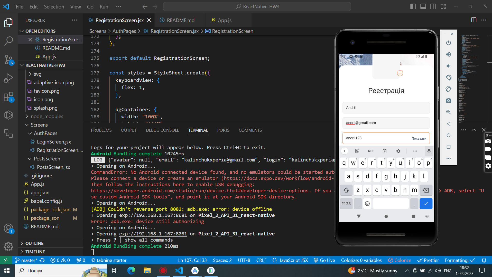
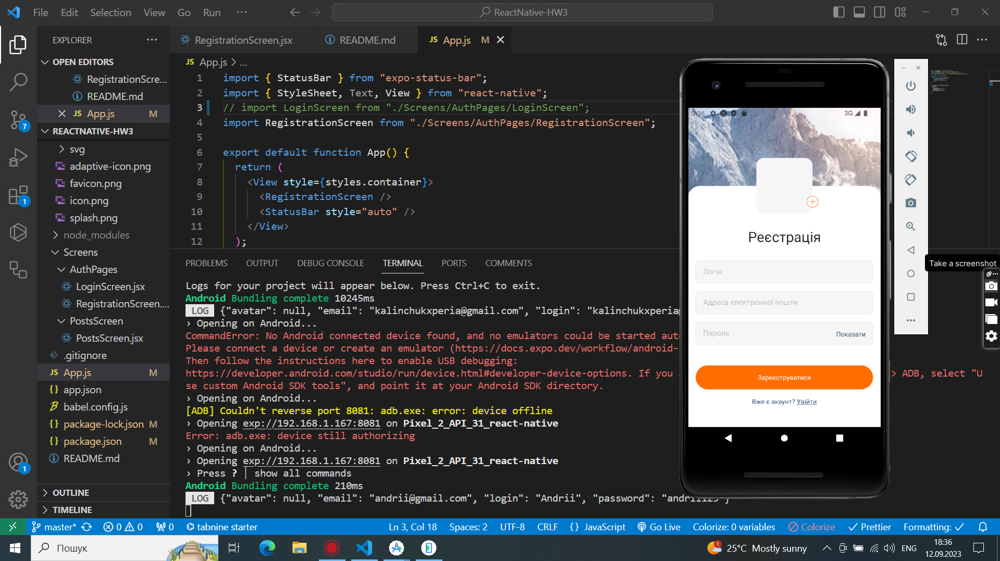
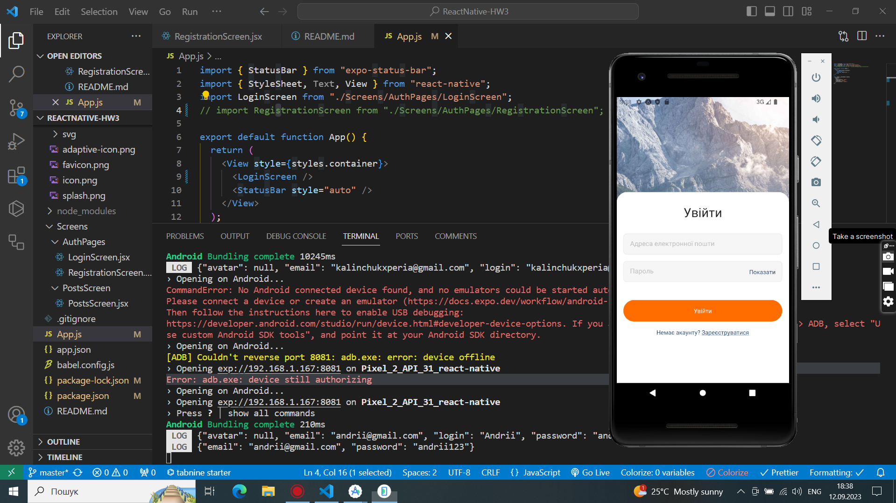
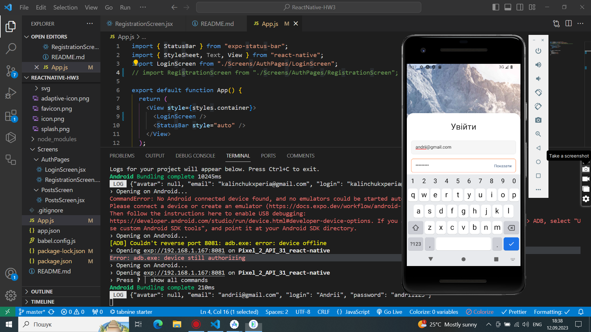

Завдання​
Додати логіку роботи з формою в компонент RegistrationScreen

Додати логіку роботи з формою в компонент LoginScreen

Під час сабміту форм збирати дані з них і виводити в консоль

Додати автозакриття клавіатури по кліку за межами форм (Використовуємо Keyboard.dismiss)

Макет компонента RegistrationScreen

Макет компонента RegistrationScreen з відкритою клавіатурою

Макет компонента LoginScreen

Макет компонента LoginScreen з відкритою клавіатурою

Result

